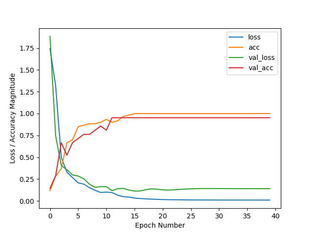

[//]: # (Image References)

[image1]: ./assets/race_car_cad.png "Race car"
[image2]: ./assets/track_cad.png "Monaco track"
[image3]: ./assets/gazebo_model_tree.png "Gazebo model - Monaco"
[image4]: ./assets/Gazebo_sim.png "Gazebo szimuláció"
[image5]: ./assets/rqt_cam.png "Kamera kép - rqt"

# Kognitív robotika projekt feladat
Kognitív robotika tárgynak féléves projekt feladata, ahol ROS Noetic környezetben fejlesztettem egy mobil robotot.

A projektet készített:
* Czémán Róbert

## Tartalomjegyzék
1. [Feladatleírás](#feladatleírás)
2. [Telepítési útmutató](#telepítési-útmutató)
3. [Szimuláció futtatása](#szimuláció-futtatása)
4. [Versenypálya megtervezése](#versenypálya-megtervezése)  
4.1. [Gazebo szimuláció](#gazebo-szimuláció)
5. [Versenyautó megtervezése](#versenyautó-megtervezése)  
5.1. [RViz szimuláció](#rviz-szimuláció)
6. [Alaklmazott szenzorok](#alkalmazott-szenzorok)  
6.1. [Kamera](#kamera)
7. [Kormányzás](#kormányzás)
8. [Képfeldolgozás](#képfeldolgozás)  
8.1. [Képfeldolgozás lépései](#képfeldolgozás-lépései)  
8.2. [Nehézségek a képfeldolgozás során](#nehézségek-a-képfeldolgozás-során)  
8.3 .[A problémák megoldása](#a-problémák-megoldása)  
8.4. [Az alkalmazott megoldások hátrányai](#az-alkalmazott-megoldások-hátrányai)


## Feladatleírás
A feladat megvalósítása során a következő pontoknak kellett eleget tennünk:
* méretarányosan kicsinyített versenypálya készítése,
* versenyautó modell készítése,
* a robot autonóm vezetése saját ROS node segítségével.

## Telepítési útmutató
1. A repositoryt az alábbi paranccsal tudjuk megszerezni:
```console
git clone https://github.com/czrobi2001/KogRob_HW_23_24.git
```
2. XServer telepítése (grafikus alkalmazás futtatása miatt)
    * a telepítés megtehető például a következő linkre kattintva: [XServer](https://sourceforge.net/projects/vcxsrv/)
    * XServer konfigurálása: Az *Extra settings* oldalon pipáljuk be a *Disable access control* opciót, valamint az *Additional parameters for VcXsrx* felirítú mezőbe gépeljük be a következők:
    ```console
    -nowgl
    ```
3. Szükséges függőségek (dependency) telepítése:
    * 1
    * 2
    * ...

A lépések teljesítésével már képesek leszünk a szimulációt futtatni. Ennek a lépéseit a követkeező fejezet tartalmazza.

## Szimuláció futtatása
A szimuláció elindításhoz először a mobil robotot kell megnyitni **gazebo**-ban, amit az alábbi paranccsal tehetünk meg.
  ```console
  roslaunch line_follower spawn_robot.launch
  ```

Majd miután elindult a szimuláció elindíthatjuk a `follow_curve.py` scriptet, ami a képfeldogozást végzi.
  ```console
  rosrun line_follower line_follower_cnn.py
  ```

Ha az irányításhoz használt paraméterekre is kíváncsiak vagyunk, akkor egy 3. terminál ablakba írjuk be a következőt:
  ```console
  rqt
  ```

Miután megnyílt az **rqt** a Plugins > Topics > Topic Monitor menüpontra kattintás után keressük ki a *cmd_vel* topicot és pipáljuk be. Ezen belül a *linear* és *angular* opciókat lenyitva láthatók a pontos értékek.


## Versenypálya megtervezése
A versenypályát Solidworks-ben egy letöltött, és importált kép segítségével terveztem meg, aminek kontúrját körberajzoltam Besier görbékkel, és kiexportáltam egy `.stl` fájlt.

A pálya kontrúja
![alt text][image2] 

Blenderbe beimportálva készítettem egy a gazebo által is kezelhető collada mesht, ami tartalmazza a blenderben beállított színeket is. Ahhoz, hogy a Gazebo megnyitáskor lássa a modellt, az alábbi sort kell a `.bashrc`-hez hozzá adni.

```console
export GAZEBO_MODEL_PATH=$GAZEBO_MODEL_PATH:~/bme_catkin_ws/src/KogRob_HW_23_24/gazebo_models
```

### Gazebo szimuláció

A modellt a szimulációs környezetben, vagyis a **gazebo**-ban is megtekinthetjük, ehhez az alábbi parancsot futtassuk:
```console
roslaunch line_follower world.launch 
```

A szimuláció elindításához egy `.world` kiterejesztésű fájlra van szükségünk, ami tartalmazza a világ, szimulációhoz szükséges fizikai beállításait, valamint a hozzáadott további modelleket.

  ![alt text][image4]

A kocsi beimportálása a világba a `spawn_robot.launch` fájl elindításával történik, ahol argumentumként a robot kezdeti pozícióját is megadhatjuk.


## Versenyautó megtervezése
A versenyautó tervezésnék ötletét internetes forrásból vettem, ami egy kis lego kocsi, amit Solidworks-ben az egyszerűbb kezelhetőség érdekében módosítottam.

  ![alt text][image1]

Ezekután blenderben beállítottam a megfelelő színeket, majd exportáltam egyenként a mozgó komponenseket. A mobil robot vázát illetve a szimulációhoz szükséges paraméterek beállítását a `mogi_bot.xacro` fájlban tettük meg, a robot irányításáért és a kamera képért felelős gazebo plug-in-ket a `mogi_bot.gazebo` fájlban adtuk hozzá.

### RViz szimuláció

A robot modellt megtekinthetjük **RViz**-ben az alábbi parancs segítségével:
```console
roslaunch line_follower_race_car check_urdf.launch
```

## Alkalmazott szenzorok
A képfeldogozáshoz egy kamera került elhelyezésre a versenykocsi elején, aminek paramétereit az órán használtak alapján állítottuk be.

### Kamera

  A kamerát az alábbi plugin valósítja meg. 
  ```xml
  <plugin name="camera_controller" filename="libgazebo_ros_camera.so">
    <alwaysOn>true</alwaysOn>
    <updateRate>0.0</updateRate>
    <cameraName>head_camera</cameraName>
    <imageTopicName>image_raw</imageTopicName>
    <cameraInfoTopicName>camera_info</cameraInfoTopicName>
    <frameName>camera_link_optical</frameName>
    <hackBaseline>0.07</hackBaseline>
    <distortionK1>0.0</distortionK1>
    <distortionK2>0.0</distortionK2>
    <distortionK3>0.0</distortionK3>
    <distortionT1>0.0</distortionT1>
    <distortionT2>0.0</distortionT2>
  </plugin>
  ```
 

## Kormányzás
A kormányzás megtervezése volt az egyik fő feladat a projekt során. Fontos volt a megfelelő típus kiválasztása, mivel a pálya és az autó adottságai miatt több szempontnak is meg kellett felelni. Ezek közül például kiemelném azt, hogy az autónak képesnek kell lennie nagyon kis íven is elfordulnia.

Végül a feladatot a `skid-steer` kormányzással valósítottuk meg. Az erre alkalmazott plugin:
```xml
<gazebo>
  <plugin name="ros_force_based_move" filename="libgazebo_ros_force_based_move.so">
    <commandTopic>cmd_vel</commandTopic>
    <odometryTopic>odom</odometryTopic>
    <odometryFrame>odom</odometryFrame>
    <torque_yaw_velocity_p_gain>10000.0</torque_yaw_velocity_p_gain>
    <force_x_velocity_p_gain>10000.0</force_x_velocity_p_gain>
    <force_y_velocity_p_gain>10000.0</force_y_velocity_p_gain>
    <robotBaseFrame>base_footprint</robotBaseFrame>
    <odometryRate>50.0</odometryRate>
    <publishOdometryTf>true</publishOdometryTf>
  </plugin>
</gazebo>
```

## Képfeldolgozás

### Képfeldolgozás lépései
A robot irányításáért a `line_follower_cnn.py` nevű Python script felel.

1. tanító képek mentése, és címkézése `save_training_images.py` segítségével
  * a **gazebo** szimulációban készített kameraképek kimentése
  * a képek címkézése, kiválogatása jobb, bal, előre, és semmi képekre,amik a neurális háló tanító bemenetei lesznek.
  
2. neurális háló tanítása

    Az alkalmazott neurális háló LeNet jellegű konvolúciós neruális háló, ami 24x24 képet vár bemenetként, és 4 kimenetet szolgáltat, amik: 

    * Előre
    * Jobbra
    * Balra
    * Ne mozdulj!
    
    A LeNet neurális hálóról bővebben: [LeNet](https://en.wikipedia.org/wiki/LeNet "LeNet")

    Neurális háló tanításához az órán is használt Python scriptet használtam, aminek futtatásával a címkézett tanító minták alapján meghatározza a modell paramétereit, majd elmenti a tanítás során az aktuális modellt, valamint a legjobbat is.

    A tanításhoz az alábbi sort kell lefuttatni parancsorban, a scriptet tartalmazó mappán belül:

    ```console
    python3 train_network.py
    ```


3. iteráció, amíg a modell nem elég pontos, és nem elég alacsony a veszteség a tanítás előrehaladtával

    A tanítás addig folytatódott, amíg a mobil robot minden kanyart hibátlanul nem vett, ahol elakadt rátanítás volt szükséges. Az **1.** és **2.** pontok között iteráltam addig, amíg nem kaptam egy megfelelő modellt.

    
    

4. robot irányításához szükséges paraméterek meghatározása
    * ezek a paraméterek a robot sebessége az x-tengelye mentén (`linear.x`) és az elfordulása a z-tengelye mentén (`angular.z`)
    * a paramétereket, amiket feltételben vitsgálunk, a neurális háló kimenetei

    ```python
        last_change = time.time()-self.last_time

        print("Prediction %d, elapsed time %.3f" % (prediction, last_change ))
        
        # reset the timer when change the cnn output
        if pred_prev != prediction:
            self.last_time = time.time()

        # last change reaches defined value change the speed/rotation
        if prediction == 0: # Forward
            self.cmd_vel.angular.z = 0

            if last_change > 3:
                self.cmd_vel.linear.x = 1
            else:
                self.cmd_vel.linear.x = 0.2

        elif prediction == 1: # Left
            if last_change > 0.5:
                self.cmd_vel.angular.z = -1
                self.cmd_vel.linear.x = 0
            else:
                self.cmd_vel.angular.z = -0.5
                self.cmd_vel.linear.x = 0.02

        elif prediction == 2: # Right
            if last_change > 0.5:
                self.cmd_vel.angular.z = 1
                self.cmd_vel.linear.x = 0.02
            else:
                self.cmd_vel.angular.z = 0.5
                self.cmd_vel.linear.x = 0.02

        else: # Nothing
            self.cmd_vel.angular.z = 0.0
            self.cmd_vel.linear.x = 0.0


        if pred_prev != prediction:
            self.last_time = time.time()
        
        pred_prev = prediction
    ```
5. a meghatározott paraméterek közlése
    * a paramétereket a *cmd_vel* topic-ba küldjük `Twist` üzenet formájában

### Nehézségek a képfeldolgozás során
Sok-sok kísérletezést követően eljutottam oda, hogy a robot képes végighaladni a teljes pályán hiba nélkül, egész jó tempóban. A korábbi verziókban az alábbi hibák álltak fenn:
1. a kanyarokat nagyon lassan veszi be
2. kanyar szélén nem ismeri fel a háló a kanyarodást 

### A problémák megoldása
Az előző részben említett problémákra végül a következő megoldásokat eszközöltem:
1. minden mozgást meghatározó feltételben pluszban vizsgálok egy változót, aminek értékét figyelem aszerint, hogy mennyi idő telt el az utolsó háló kimenet változás óta. Ha ez meghaladja a beállított értéket, növelem a beavatkozást addig, amíg nem változik a háló kimenete.
2. a problémát az idézte elő, hogy nem volt elég tanító minta minden esethez, így rá kellett tanítani a hálóra az új képekkel.

### Az alkalmazott megoldások hátrányai
1. az meghatározott időértékek alapvetően a jelenlegi pálya alapján lettek kikísérletezve, így nem garantálható, hogy minden más esetben megfelleően fog működni
2. változtatva a beavatkozás mértékét új pálya ívekre futhat a robot az eddig megszokottól, így lehetséges, hogy újabb tanítás lesz szükséges az új képekkel

<video src="./assets/gazebo.mp4" width="320" height="240" controls></video>